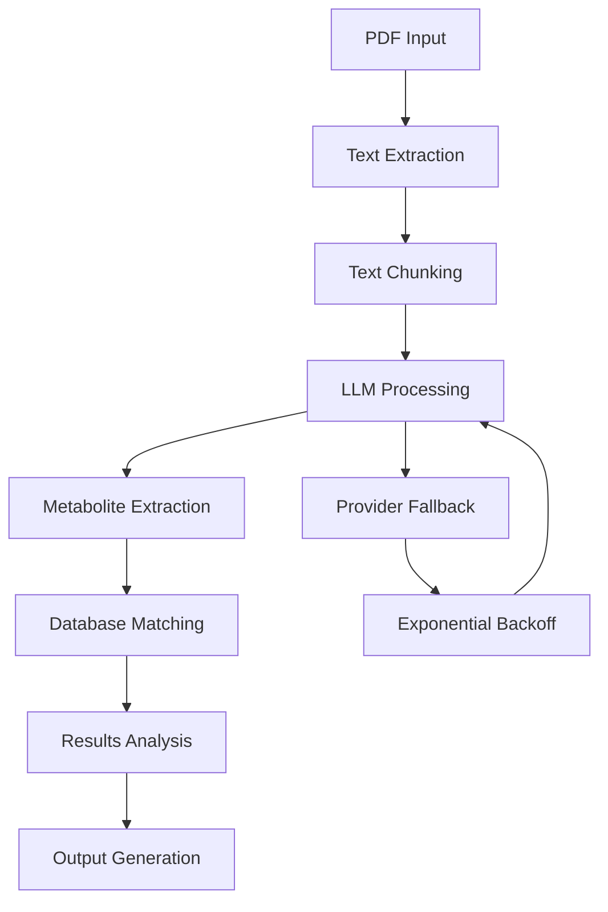

# FOODB Pipeline - Technical Documentation

## 🏗️ Architecture Overview

The FOODB Pipeline is a modern, CLI-based system for extracting metabolites and biomarkers from scientific PDF documents using multiple LLM providers with robust fallback mechanisms.

### Core Components

```
foodb_pipeline_cli.py          # Main CLI interface with argument parsing
foodb_pipeline_runner.py       # Pipeline execution engine
llm_wrapper_enhanced.py        # LLM provider management with fallback
FOODB_LLM_pipeline/           # Legacy pipeline components
```

### Processing Flow



## 🔧 Technical Specifications

### LLM Provider Integration

#### Provider Hierarchy
1. **Cerebras** (Primary): Fast inference, good for batch processing
2. **Groq** (Secondary): Reliable fallback with good performance
3. **OpenRouter** (Tertiary): Final fallback with multiple model options

#### Fallback Mechanism
```python
# Exponential backoff configuration
RetryConfig(
    max_attempts=5,
    base_delay=2.0,
    max_delay=60.0,
    exponential_base=2.0,
    jitter=True
)
```

#### Rate Limiting Handling
- **Automatic detection** of rate limit responses
- **Provider switching** when limits exceeded
- **Exponential backoff** with jitter for retry timing
- **Statistics tracking** for performance monitoring

### Text Processing Pipeline

#### PDF Text Extraction
```python
def extract_pdf_text(input_file: str) -> Dict[str, Any]:
    """
    Extracts text from PDF using PyPDF2
    Returns: {
        'text': str,
        'pages': int,
        'characters': int,
        'extraction_time': float
    }
    """
```

#### Text Chunking
```python
def chunk_text(text: str, chunk_size: int, overlap: int) -> List[str]:
    """
    Splits text into overlapping chunks
    - chunk_size: Target size in characters (default: 1500)
    - overlap: Overlap between chunks (default: 0)
    - min_chunk_size: Minimum chunk size to process (default: 100)
    """
```

#### Metabolite Extraction
```python
def extract_metabolites_document_only(chunk: str, max_tokens: int) -> str:
    """
    Document-only extraction to prevent training data contamination
    Uses specific prompts that focus only on document content
    """
```

### Database Matching System

#### Matching Algorithm
```python
def match_database(metabolites: List[str], csv_biomarkers: Set[str]) -> Dict:
    """
    Multi-level matching strategy:
    1. Exact string match (case-insensitive)
    2. Meaningful partial match (length > 5 characters)
    3. Bidirectional substring matching
    """
```

#### Performance Metrics
```python
def calculate_metrics(true_positives: int, false_positives: int, false_negatives: int):
    """
    Calculates:
    - Precision: TP / (TP + FP)
    - Recall: TP / (TP + FN)
    - F1 Score: 2 * (Precision * Recall) / (Precision + Recall)
    """
```

## 📁 Output Structure Design

### Standard Mode
```
output_directory/
├── {filename}_{timestamp}_results.json      # Complete results
├── {filename}_{timestamp}_results.csv       # Metabolites table
├── {filename}_{timestamp}_results.xlsx      # Multi-sheet workbook
└── {filename}_{timestamp}_timing.json       # Performance analysis
```

### Directory Mode
```
output_directory/
├── individual_papers/                       # Timestamped individual results
│   ├── paper1_{timestamp}.json
│   ├── paper1_{timestamp}.csv
│   └── paper1_{timestamp}_timing.json
├── consolidated/                            # Append-mode consolidated results
│   ├── consolidated_results.json           # Historical runs
│   ├── consolidated_metabolites.csv        # All metabolites
│   ├── consolidated_results.xlsx           # Multi-sheet analysis
│   └── processing_summary.json            # Run summaries
└── batch_summary_{timestamp}.json          # Current batch summary
```

### Consolidated Data Structure
```json
{
  "processing_runs": [
    {
      "timestamp": "2025-07-16 23:19:47",
      "summary_stats": {
        "total_papers": 2,
        "total_unique_metabolites": 190,
        "average_detection_rate": 0.728
      },
      "paper_results": [...],
      "all_unique_metabolites": [...],
      "all_unique_matches": [...]
    }
  ]
}
```

## 🔄 Error Handling & Recovery

### Retry Mechanisms
```python
class RetryConfig:
    max_attempts: int = 5
    base_delay: float = 2.0
    max_delay: float = 60.0
    exponential_base: float = 2.0
    jitter: bool = True
```

### Provider Switching Logic
```python
def handle_rate_limit():
    """
    1. Detect rate limit response
    2. Switch to next provider in fallback order
    3. Apply exponential backoff
    4. Track statistics for monitoring
    """
```

### Recovery Strategies
- **Chunk-level recovery**: Resume from specific chunk
- **Provider exhaustion**: Switch to next provider
- **Complete failure**: Detailed error logging and graceful degradation

## 📊 Performance Optimization

### Chunking Strategy
```python
# Optimal chunk sizes for different scenarios
CHUNK_SIZES = {
    'speed': 2000,      # Faster processing, fewer API calls
    'accuracy': 1000,   # Better extraction, more context
    'balanced': 1500    # Default balanced approach
}
```

### API Call Optimization
```python
# Rate limiting prevention
DELAY_STRATEGIES = {
    'conservative': {'base_delay': 3.0, 'max_delay': 120.0},
    'balanced': {'base_delay': 2.0, 'max_delay': 60.0},
    'aggressive': {'base_delay': 1.0, 'max_delay': 30.0}
}
```

### Memory Management
```python
# Memory-efficient processing
def process_large_documents():
    """
    - Stream processing for large files
    - Chunk-by-chunk processing
    - Garbage collection between chunks
    - Optional chunk saving to disk
    """
```

## 🧪 Testing Framework

### Unit Tests
```python
# Test individual components
test_pdf_extraction()
test_text_chunking()
test_metabolite_parsing()
test_database_matching()
test_metrics_calculation()
```

### Integration Tests
```python
# Test complete workflows
test_single_file_processing()
test_directory_processing()
test_provider_fallback()
test_append_mode()
test_timestamp_functionality()
```

### Performance Tests
```python
# Benchmark performance
test_processing_speed()
test_memory_usage()
test_api_rate_limits()
test_large_document_handling()
```

## 🔐 Security Considerations

### API Key Management
```python
# Secure API key handling
load_dotenv()  # Load from .env file
api_keys = {
    'cerebras': os.getenv('CEREBRAS_API_KEY'),
    'groq': os.getenv('GROQ_API_KEY'),
    'openrouter': os.getenv('OPENROUTER_API_KEY')
}
```

### Data Privacy
- **Document-only mode**: Prevents training data contamination
- **Local processing**: Text extraction and chunking done locally
- **API data**: Only text chunks sent to LLM providers
- **No data retention**: Providers don't store processed content

### Input Validation
```python
def validate_inputs():
    """
    - PDF file validation
    - Path sanitization
    - Parameter bounds checking
    - Configuration validation
    """
```

## 📈 Monitoring & Analytics

### Statistics Tracking
```python
class ProcessingStatistics:
    total_chunks: int
    successful_chunks: int
    failed_chunks: int
    provider_usage: Dict[str, int]
    retry_events: List[Dict]
    processing_times: List[float]
```

### Performance Metrics
```python
def generate_performance_report():
    """
    - Processing speed analysis
    - Provider performance comparison
    - Error rate tracking
    - Resource utilization metrics
    """
```

### Logging Configuration
```python
# Comprehensive logging setup
logging.basicConfig(
    level=logging.INFO,
    format='%(asctime)s - %(name)s - %(levelname)s - %(message)s',
    handlers=[
        logging.FileHandler('pipeline.log'),
        logging.StreamHandler()
    ]
)
```

## 🔧 Configuration Management

### CLI Arguments
```python
# 40+ configurable parameters organized in groups:
- Output Configuration (8 parameters)
- Database Configuration (2 parameters)
- Text Processing (3 parameters)
- LLM Configuration (4 parameters)
- Retry/Fallback (5 parameters)
- Provider Configuration (2 parameters)
- Processing Configuration (4 parameters)
- Analysis Configuration (3 parameters)
- Logging/Debugging (5 parameters)
- Configuration File (2 parameters)
```

### Configuration File Format
```json
{
  "output_dir": "./results",
  "directory_mode": true,
  "document_only": true,
  "chunk_size": 2000,
  "max_tokens": 300,
  "providers": ["cerebras", "groq", "openrouter"],
  "max_attempts": 5,
  "base_delay": 2.0,
  "export_format": "all",
  "timestamp_files": true
}
```

## 🚀 Deployment Considerations

### Production Setup
```bash
# Environment setup
python -m venv foodb_production
source foodb_production/bin/activate
pip install -r requirements.txt

# Configuration
cp example_config.json production_config.json
# Edit production_config.json with production settings

# API keys
echo "CEREBRAS_API_KEY=your_key" > .env
echo "GROQ_API_KEY=your_key" >> .env
echo "OPENROUTER_API_KEY=your_key" >> .env
```

### Scaling Strategies
```python
# Horizontal scaling options
- Multiple worker processes
- Load balancing across API providers
- Distributed processing for large document sets
- Caching for repeated document processing
```

### Monitoring Setup
```python
# Production monitoring
- API usage tracking
- Error rate monitoring
- Performance metrics collection
- Resource utilization alerts
```
